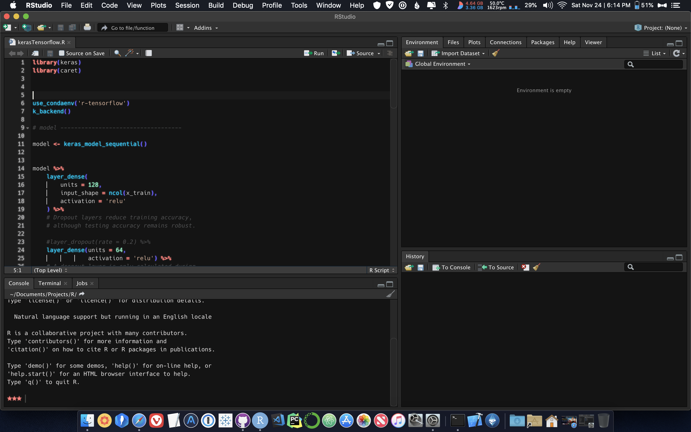

# Overview

This is something I did for fun, and figured other people
might want to have more control
over their RStudio experience. I personally use a Mac,
so I'll be able to provide better support for macOS.
However, I do use a PC for work and have found this to work on Windows also.

I have little experience in writing css and javascript,
and even less experience in building IDEs. I did most of the work
in RStudio's DevTools, by selecting elements
and changing their properties. So, if anyone would
like to help out by contributing, please do! I'd love the help :smile:.

## This is not an editor theme

RStudio v1.2 introduced the ability to import [your own theme](https://rstudio.github.io/rstudio-extensions/rstudio-theme-creation.html). **daRkStudio is not an editor theme**, and does not change the syntax highlighting in the editor. daRkStudio is an *RStudio theme*, that changes the default appearance of the Modern and Sky *RStudio themes* when using a dark *editor theme* (this is set by having `rs-theme-is-dark: TRUE` somewhere in an `*.rstheme` file).

RStudio, by default, has three themes: Classic, Modern, and Sky (you can see for yourself by going to `Global Options -> Appearance -> RStudio theme`).
On RStudio's Support page, there is a fourth theme listed, called [Dark](https://support.rstudio.com/hc/en-us/articles/115011846747-Using-RStudio-Themes#dark-theme).

> The dark theme is a superset to the Modern and Sky themes that is activated whenever the Editor theme uses a dark palette.

Meaning, when the editor theme is dark (i.e. `rs-theme-is-dark: TRUE`), RStudio's panels, borders, tabs, and menus will be the same color if you select Modern or Sky as the RStudio theme.

If you're curious, they use a different palette when using a [light theme](https://support.rstudio.com/hc/en-us/articles/115011846747-Using-RStudio-Themes#modern-theme).

Classic, however, does not change its appearance, regardless of `rs-theme-is-dark: TRUE` or `rs-theme-is-dark: FALSE`.
I think this can be overriden, but I don't plan to do so with daRkStudio.

TL;DR: whether you have your RStudio theme set to Modern or Sky, daRkStudio will work as long as you're using a dark editor theme.

## Pics or it didn't happen



Here, the RStudio theme is set to Modern (remember, Sky would work here as well), and the editor theme is using an `*.rstheme` with `rs-theme-is-dark: TRUE`.

## Installation

**You may want to back up the original files.**

I recommend placing them into a folder, something like `before-daRkStudio`,
`RStudio-original`, `original-rstudio-files-that-were-there-before-i-started-using-this-awesome-theme` etc., somewhere outside of RStudio's file directory (so they won't be removed when you update RStudio!).

### macOS

```sh
git clone https://github.com/livelaughriley/daRkStudio

cp "daRkStudio/custom_styles.css" \
    "/Applications/RStudio.app/Contents/Resources/www/custom_styles.css"

cp "daRkStudio/index.htm" \
    "/Applications/RStudio.app/Contents/Resources/www/index.htm"
```

### Windows

```powershell
git clone https://github.com/livelaughriley/daRkStudio

Copy-Item "daRkStudio\custom_styles.css" `
    "C:\Program Files\RStudio\www\custom_styles.css" `
    -Force

Copy-Item "daRkStudio\index.htm" `
    "C:\Program Files\RStudio\www\index.htm"
    ` -Force
```

You may not have the permission to copy or overwrite items in `C:\Program Files`.
If that's the case, run PowerShell in an elevated prompt (as an Adminstrator)
and try to copy the items to `C:\Program Files\RStudio\Resources\www\custom_styles.css`
again. If that doesn't work, try opening the daRkStudio folder from File Explorer, and manually copying the files to the `C:\Program Files\RStudio\Resources\www\` directory.

If you're STILL unable to copy the files (it's Windows, so who knows?) open an issue and I'll do what I can to help.

### Linux

It's been a while since I've used RStudio on Linux (Kubuntu 18.04), so I'm not sure if the paths shown below are still correct.
If you're using Linux and find that these paths no longer work, please open an issue or pull request.

```bash
git clone https://github.com/livelaughriley/daRkStudio

cp "daRkStudio/custom_styles.css" \
    "/usr/local/rstudio/<version-goes-here>/resources/www/custom_styles.css"

cp "daRkStudio/index.htm" \
    "/usr/local/rstudio/<version-goes-here>/resources/www/index.htm"
```

## Updating

If you cloned the repositories, `cd` into the direcory that contains this repo.

Execute `git pull --rebase`, and copy the files to `RStudio`'s `www` directory again.

If you run into any troubles, please file an issue.

## I love you

Thanks for checking out daRkStudio.

If you like it, you can show support by starring this repo.
Or, if you know someone who may like daRkStudio, tell them to check it out!
