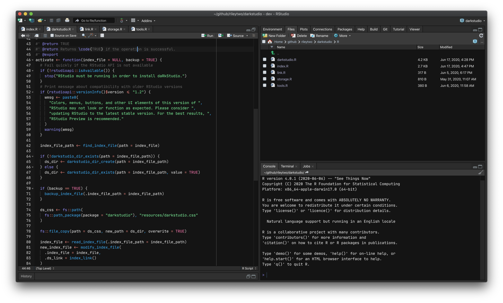
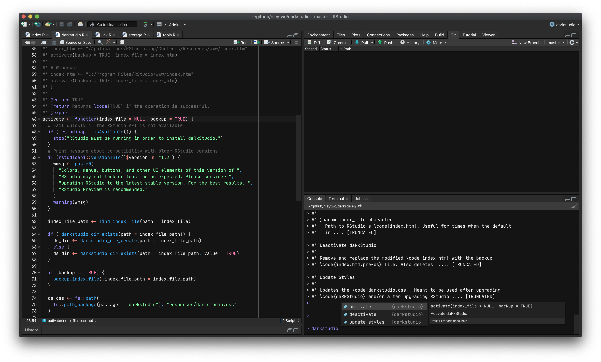
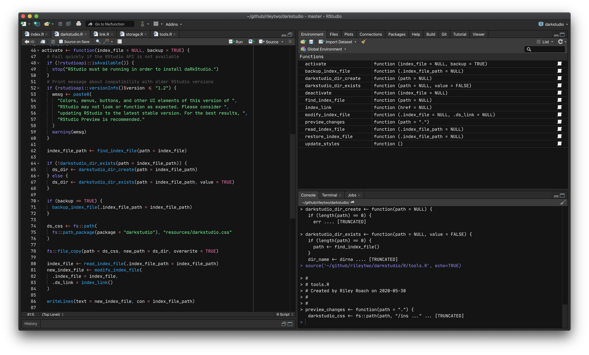

# darkstudio is a package!
darkstudio can now be installed as an R package. Instructions are below.

# Overview

This is something I did for fun, and figured other people might enjoy this as much as I do.

I have little experience in writing CSS and javascript, and even less experience in building IDEs. I did most of the work in RStudio's DevTools, by selecting elements and changing their properties. So, if anyone would like to help out by contributing, please do! I'd love the help :smile:.

## This is not an editor theme

RStudio v1.2 introduced the ability to import [your own theme](https://rstudio.github.io/rstudio-extensions/rstudio-theme-creation.html). **darkstudio is not an editor theme**, and does not change the syntax highlighting in the editor. darkstudio is an *RStudio theme*, that changes the default appearance of the Modern and Sky *RStudio themes* when using a dark *editor theme* (this is set by having `rs-theme-is-dark: TRUE` somewhere in an `*.rstheme` file).

RStudio, by default, has three themes: Classic, Modern, and Sky (you can see for yourself by going to `Global Options -> Appearance -> RStudio theme`).
On RStudio's Support page, there is a fourth theme listed, called [Dark](https://support.rstudio.com/hc/en-us/articles/115011846747-Using-RStudio-Themes#dark-theme).

> The dark theme is a superset to the Modern and Sky themes that is activated whenever the Editor theme uses a dark palette.

Meaning, when the editor theme is dark (i.e. `rs-theme-is-dark: TRUE`), RStudio's panels, borders, tabs, and menus will be the same color if you select Modern or Sky as the RStudio theme.

If you're curious, they use a different palette when using a [light theme](https://support.rstudio.com/hc/en-us/articles/115011846747-Using-RStudio-Themes#modern-theme).

Classic, however, does not change its appearance, regardless of `rs-theme-is-dark: TRUE` or `rs-theme-is-dark: FALSE`.
I think this can be overriden, but I don't plan to do so here.

TL;DR: whether you have your RStudio theme set to Modern or Sky, darkstudio will work as long as you're using a dark editor theme.

## Pics or it didn't happen







Here, the RStudio theme is set to Modern (remember, Sky would work here as well), and the editor theme is using an `*.rstheme` with `rs-theme-is-dark: TRUE`. You can download that theme [here](https://github.com/rileytwo/kiss.git).

## Installation

This used to not be an R package and required manual copying/moving/pasting files from one place to another. Now that `darkstudio` is an R package, installation and maintenance is much simpler. However, I've kept the old installation method in the README in case anyone would rather go that route.

### Recommended Method

You can install `darkstudio` by using `install_github()` from the `remotes` or `devtools` packages.

Just run

```r
remotes::install_github("rileytwo/darkstudio")
```
in RStudio to install the package. To activate the custom theme, the next step depends on the OS you're using.

`darkstudio` alters RStudio's DOM by adding a `<link/>` handle that points to a CSS file. Unless you installed RStudio to a non-default location, you may need to elevate your privileges when activating `darkstudio`.

### Windows
Run RStudio as an administrator. Next, run

```r
darkstudio::activate()
```

in the console to activate the theme. The function will return `TRUE` if the activation was successful.

### Linux
Start RStudio from the terminal by running `sudo rstudio --no-sandbox`. 

Once RStudio is running, run

```r
darkstudio::activate()
```

in the console.

### macOS

Simply run

```r
darkstudio::activate()
```

in the console. I personally own a mac, and haven't had an trouble activating `darkstudio` with non-elevated privileges. I understand I can't speak for all mac owners, so file an issue if you run into trouble.


### Old Method
**You may want to back up the original files.**

I recommend placing them into a folder, something like `before-darkstudio`,
`RStudio-original`, `original-rstudio-files-that-were-there-before-i-started-using-this-awesome-theme` etc., somewhere outside of RStudio's file directory (so they won't be removed when you update RStudio!).

### macOS

```bash
git clone https://github.com/rileytwo/darkstudio

cp "darkstudio/darkstudio.css" \
    "/Applications/RStudio.app/Contents/Resources/www/darkstudio.css"

cp "darkstudio/index.htm" \
    "/Applications/RStudio.app/Contents/Resources/www/index.htm"
```

### Windows

```powershell
git clone https://github.com/rileytwo/darkstudio

Copy-Item "darkstudio\darkstudio.css" `
    "C:\Program Files\RStudio\www\darkstudio.css" `
    -Force

Copy-Item "darkstudio\index.htm" `
    "C:\Program Files\RStudio\www\index.htm" `
    -Force
```

You may not have the permission to copy or overwrite items in `C:\Program Files`.
If that's the case, run PowerShell in an elevated prompt (as an Adminstrator)
and try to copy the items to `C:\Program Files\RStudio\Resources\www\darkstudio.css`
again. If that doesn't work, try opening the darkstudio folder from File Explorer, and manually copying the files to the `C:\Program Files\RStudio\Resources\www\` directory.

If you're STILL unable to copy the files (it's Windows, so who knows?) open an issue and I'll do what I can to help.

### Linux

It's been a while since I've used RStudio on Linux (Kubuntu 18.04), so I'm not sure if the paths shown below are still correct.
If you're using Linux and find that these paths no longer work, please open an issue or pull request.

```bash
git clone https://github.com/rileytwo/darkstudio

cp "darkstudio/darkstudio.css" \
    "/usr/lib/rstudio/resources/www/darkstudio.css"

cp "darkstudio/index.htm" \
    "/usr/lib/rstudio/resources/www/index.htm"
```

## Updating

### Recommended Method

**WIP**

### Old Method

If you cloned the repositories, `cd` into the direcory that contains this repo.

Execute `git pull --rebase`, and copy the files to `RStudio`'s `www` directory again.

If you run into any troubles, please file an issue.

## Uninstalling

I should note here that deactivating `darkstudio` **should be done _before_ uninstalling the package.** If you don't, you'll need to manually edit the `index.htm` file. If you wish to disable `darkstudio`.

Deactivating the theme is relatively simple. The `deactivate()` function will return RStudio to it's normal appearance.

```r
darkstudio::deactivate()
```

After that, you can uninstall `darkstudio` like any other package:

```r
remove.packages('darkstudio')
```

## I love you

Thanks for checking out darkstudio.

If you like it, you can show support by starring this repo.
Or, if you know someone who may like darkstudio, tell them to check it out!
